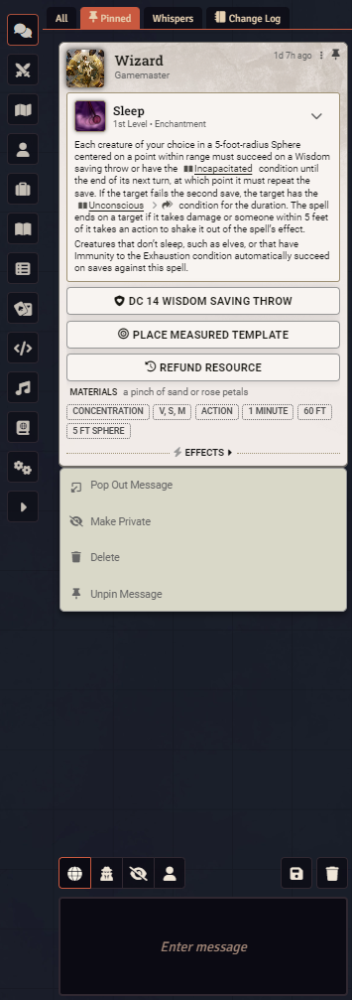

[](https://discord.gg/AyaGmYPfx)
  [](https://forge-vtt.com/bazaar#package=custom-chat-tabs)

# Custom Chat Tabs

A system-agnostic Foundry VTT module that adds customisable chat tabs.



## Features

### Chat Tabs

A tab bar is added above the chat log with built-in and optional tabs for organising messages.

**Built-in Tabs:**
- **All** - Shows all messages
- **Pinned** - Shows pinned messages

**Optional Tabs** (enabled via settings):
- **IC** - In-character messages
- **OOC** - Out-of-character messages
- **Rolls** - Roll messages
- **Whispers** - Whispered messages

### Message Pinning

Right-click a chat message and select **Pin Message** to pin it. Pinned messages are indicated with a thumbtack icon in the message header, which can also be clicked to unpin.

### Notification Pips

When enabled, a pip indicator appears on inactive tabs when a new message appears in the tab.

### Clear and Export

The **Clear Chat Log** and **Export Chat Log** buttons are scoped to the active tab. When viewing a tab, these actions only affect messages in the tab.

## Settings

| Setting | Description |
|---------|-------------|
| Enable Chat Tabs | Enable the chat tabs |
| Show Pin Indicator | Show a pin icon on pinned messages |
| Notification Pips | Show unread notification pips on inactive tabs |
| In Character Tab | Show a tab for in-character messages |
| Out of Character Tab | Show a tab for out-of-character messages |
| Rolls Tab |  Show a tab for roll messages |
| Whispers Tab | Show a tab for whispered messages |
| Enable Debug Mode | Log debug messages to the console |

## API

Custom Chat Tabs provides a module API for other modules to register their own tabs.

### Accessing the API

```js
const api = game.modules.get("custom-chat-tabs")?.api;
```

Or via the game object:

```js
game.customChatTabs
```

### Registering a Tab

Listen for the `custom-chat-tabs.init` hook, then call `register`:

```js
Hooks.on("custom-chat-tabs.init", () => {
  const api = game.modules.get("custom-chat-tabs")?.api;
  if ( !api ) return;

  api.register({
    key: "my-module-tab",
    label: "My Tab",
    icon: "fas fa-star",
    hint: "Messages from my module",
    filter: message => message.flags?.["my-module"]?.show === true
  });
});
```

### Registration Options

| Property | Type | Required | Default | Description |
|----------|------|----------|---------|-------------|
| `key` | `string` | Yes | | Unique tab identifier |
| `label` | `string` | Yes | | Display label |
| `filter` | `Function` | Yes | | Filter function `(ChatMessage) => boolean` |
| `hint` | `string` | No | `""` | Tooltip text |
| `icon` | `string` | No | `""` | FontAwesome icon class (e.g. `"fas fa-star"`) |
| `removable` | `boolean` | No | `true` | Whether the tab can be unregistered |
| `exclusive` | `boolean` | No | `false` | Messages only appear in this tab, hidden from all others |
| `roles` | `number[]` | No | All roles | User roles that can see this tab (e.g. `[CONST.USER_ROLES.GAMEMASTER]`) |

### Exclusive Messages

Exclusive tabs hide their matched messages from all other tabs, including All. This can be set at the tab level or the message level.

**Tab-level:** All messages matching the tab's filter are exclusive.

```js
api.register({
  key: "my-private-tab",
  label: "Private",
  filter: message => message.flags?.["my-module"]?.private,
  exclusive: true
});
```

**Message-level:** Individual messages can be flagged as exclusive by setting flags on the `custom-chat-tabs` namespace:

```js
await ChatMessage.create({
  content: "This only appears in the my-module tab",
  flags: {
    "custom-chat-tabs": {
      module: "my-module-tab",
      exclusive: true
    }
  }
});
```

The `module` value should match the `key` of the registered tab.

### Role-Based Visibility

Restrict a tab to specific user roles:

```js
api.register({
  key: "gm-notes",
  label: "GM Notes",
  filter: message => message.flags?.["my-module"]?.gmNote,
  roles: [CONST.USER_ROLES.GAMEMASTER]
});
```

Users without the required role will not see the tab.

### Other API Methods

```js
// Unregister a tab
api.unregister("my-module-tab");

// Get all registered tabs
const tabs = api.getTabs(); // Returns Map<string, object>

// Switch the active tab
api.setActiveTab("my-module-tab", html);

// Toggle pin on a message
api.togglePin(messageId);
```